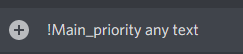
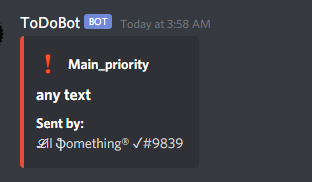
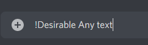
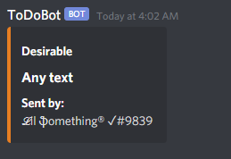
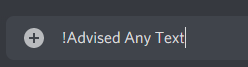
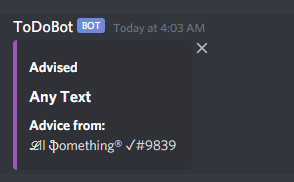

### This is tiny little documentation How To Use This Bot

##### How to start:
- Download 
- Change "***" to your TOKEN in /src/main_config.py
- Run /src/commands.py

### /MAIN_CONFIG
- Firstly, you can change bot status using:

``STATUS = "online"  # online/idle``

- Than, you can change bot presence using:

``GAME = "Genshin Impact"  # set DiscordBot game activity``

- Finally, buttons! What it is? Let me explain.

```
RED_BUTTON = "Main_priority"

YELLOW_BUTTON = "Desirable"

PURPLE_BUTTON = "Advised" 
```

RED_BUTTON:

 \


YELLOW_BUTTON:

 \


PURPLE_BUTTON:

 \


